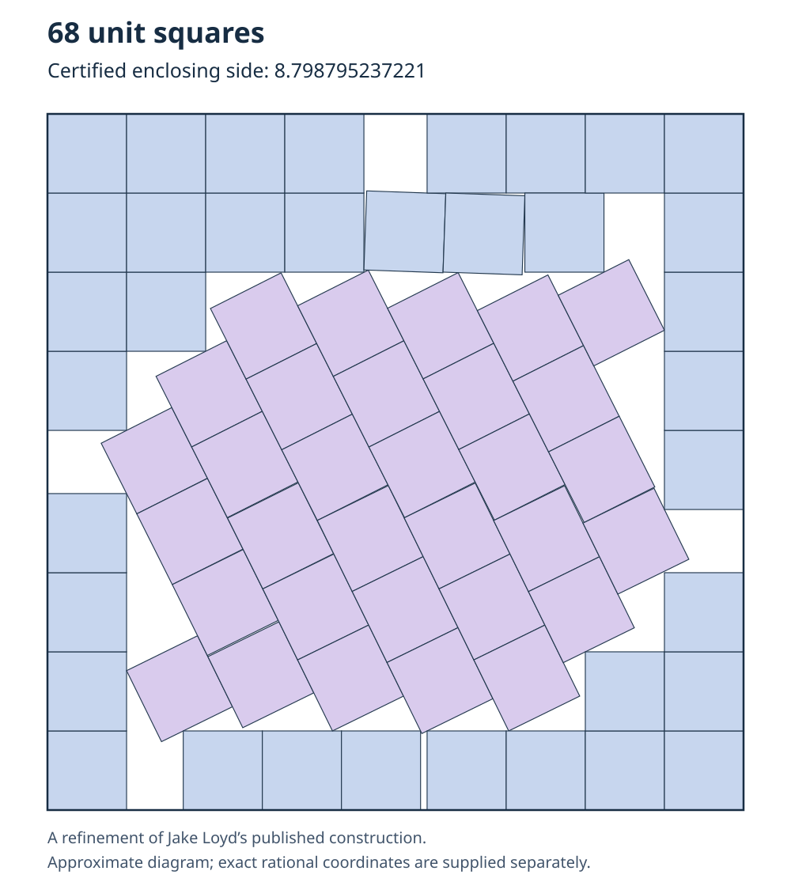

# A certified refinement of the 68-unit-square packing

This repository gives an exact construction of 68 nonoverlapping unit squares
inside a square of side

**8.798795237221 = 8798795237221 / 1000000000000.**

Every center and rotation parameter is rational. Two separately implemented
Python checkers verify containment and all **2,278 unordered pairs** using exact
fraction arithmetic and zero acceptance tolerance. Both return `valid: true`.



The drawing is an approximate rendering. The authoritative geometry is
[n68.json](n68.json), whose SHA-256 is
`00e402139c76663a4bac8dbaed8705d1b8a04ccfd32f2945065f70ade5d6eb19`.

## Reproduce the verification

Use Python 3.9 or newer with its standard library; no optimizer, network access, or
third-party packages are needed. From this repository's directory:

```bash
python3 check_hashes.py
python3 verify.py n68.json --n 68
python3 independent_support_check.py n68.json --n 68
python3 -m unittest discover -s . -p 'test_*.py' -v
```

The final command runs 25 tests, including deliberate overlaps and wall
protrusions of size `1e-30`, boundary contacts, rational rotations, and a pair
that requires a separating direction from the second square.

## Comparison and scope

The following comparison was checked on **2026-10-07**. Smaller sides are better.

| Construction / claim | Reported enclosing side | Difference from this certificate |
|---|---:|---:|
| This exact certificate | 8.798795237221 | 0 |
| franciscouzo's posted coordinate-file header | 8.798795237222592 | +0.000000000001592 |
| Kingbird's listed 68-square packing | 8.7987961402601 | +0.0000009030391 |

Sources:

- [Kingbird's table](https://kingbird.myphotos.cc/packing/squares_in_squares.html)
- [franciscouzo's n68 file, pinned to the audit's reviewed revision](https://github.com/franciscouzo/square-packing/blob/6042c56b43b64c09fe5a32c64879e698f399beaf/n68.txt)
- [Earlier pending n68 submission by dorfuchs93](https://github.com/Davidebyzero/packing_squares_in_squares__tools/issues/2)

The certified side is smaller than the two stated numerical values. The earlier
pending submission supplies no side or coordinates in its public issue, so it
cannot be compared. Record recognition and historical priority remain unresolved.
The comparison does not establish a global minimum, a novel packing arrangement,
or superiority to every unpublished or unindexed construction.

## Attribution and provenance

Refinement and certification: Seth Rehwaldt, assisted by Codex.

The supplied provenance identifies
[Jake Loyd's September 19, 2026 packing](https://kingbird.myphotos.cc/packing/square-68.svg)
as the starting construction. The earlier contributors and construction history
are credited in the linked Kingbird page and SVG. This contribution is a
refinement of that published construction.

The supplied method used constrained numerical optimization and finite seeded
perturbations, followed by rational repair before export. This small publication
package reproduces the final certificate verification. Reproducing the complete
search requires the original search project and its inputs.

The original `independent-audit.zip` can be attached unchanged to a GitHub release
as supporting material. Its full-workflow replay additionally requires a separate
`candidate-export.zip`, which was not included in the supplied audit ZIP. The
standalone certificate checks above do not require that original archive.

See [VERIFICATION.md](VERIFICATION.md) for exact margins and review details.
